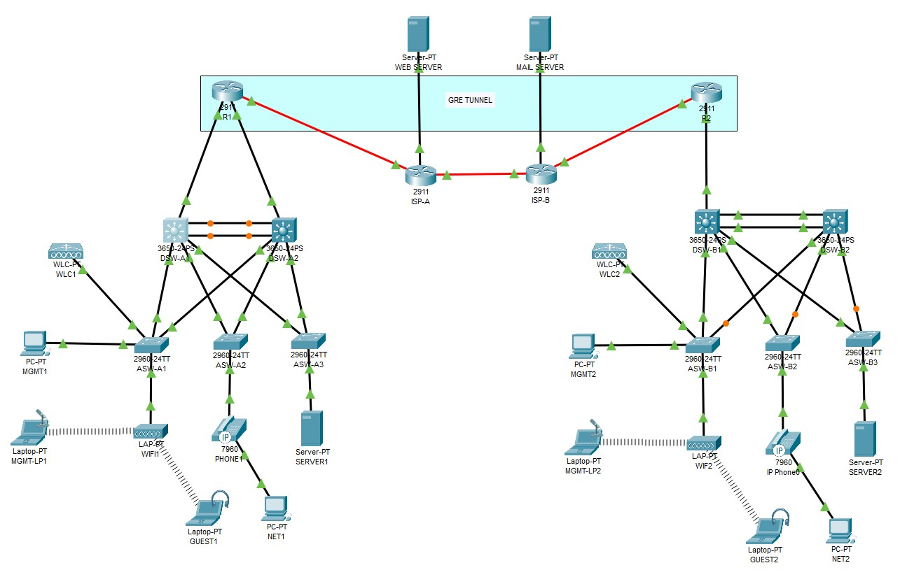
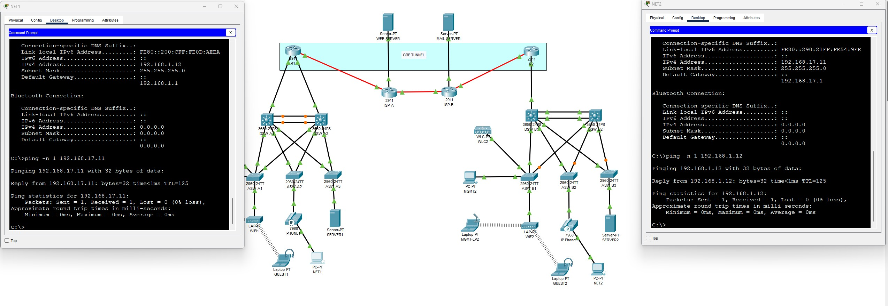
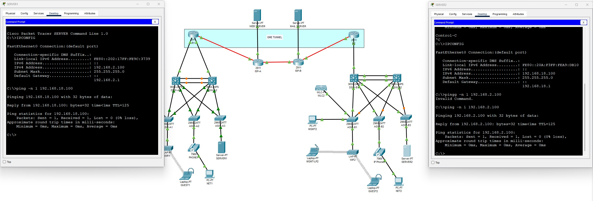
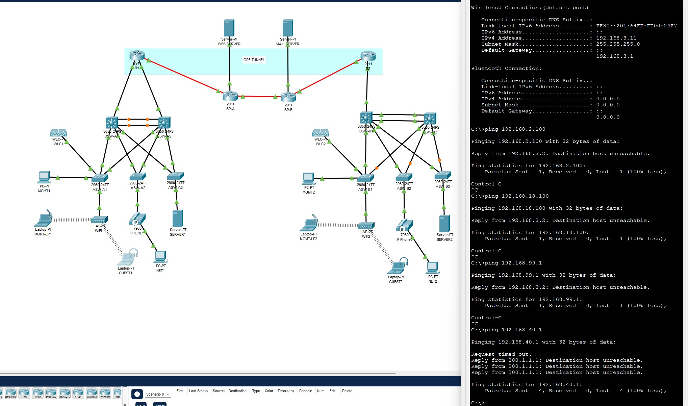
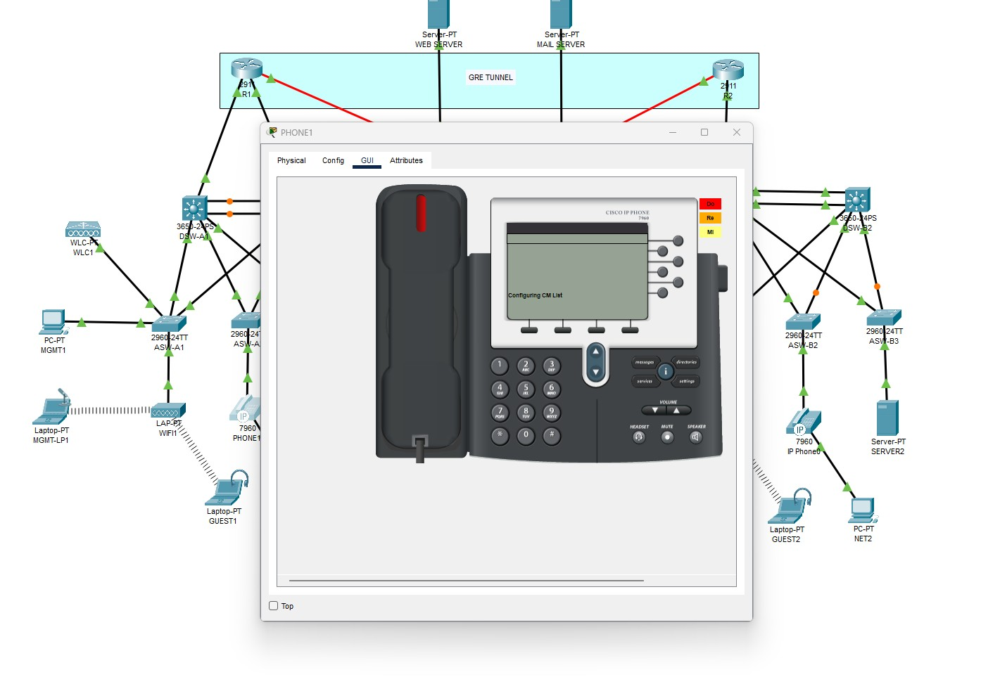
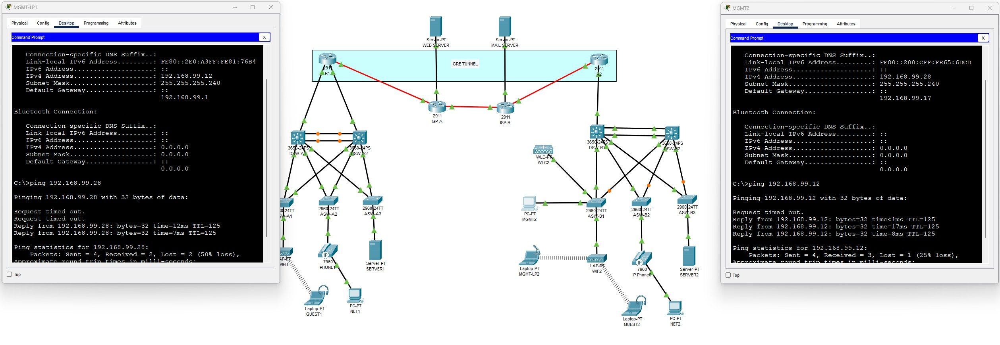
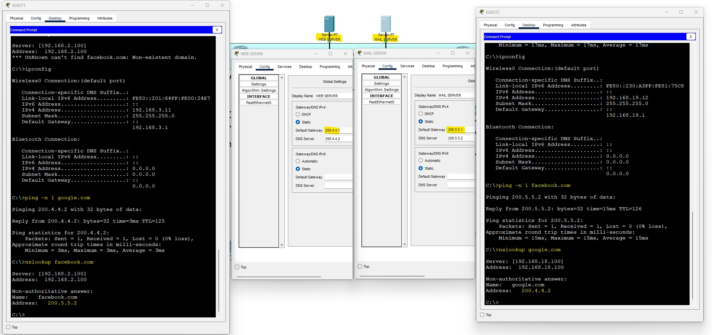

# ✅ Connectivity Testing – Multi-Site Network

This section documents successful connectivity tests between VLANs, services, and WAN endpoints in the CCNA LAB environment. Each image illustrates a step of the functional validation process.

## 🌐 Full Network Topology

A comprehensive view of both Office 1 (Barcelona) and Office 2 (Madrid), connected via GRE tunnel through ISP-A and ISP-B. Includes distribution and access layers, servers, phones, WLCs, and clients.

## 📡 VLAN Connectivity Validation

### 🖥️ VLAN 10 – Internal Network

✅ Endpoints in VLAN 10 can ping each other across the GRE tunnel.

### 🖥️ VLAN 20 – Servers

✅ Both server segments confirm bidirectional reachability for service hosting and DNS resolution.

### 🧑‍💻 VLAN 30 – Guest

✅ Guest users receive proper DHCP addresses and DNS queries resolve correctly. Restricted access is enforced.

### ☎️ VLAN 40 – Voice

✅ IP phones reach the Call Manager (TFTP) and SIP/RTP traffic is permitted for VoIP functionality.

### 🔐 VLAN 99 – Management

✅ Management workstations across sites reach one another with limited, filtered ICMP connectivity.

## 🌍 WAN / Internet Connectivity

✅ Web and Mail servers configured with static IPs and DNS can reach public DNS services and resolve internet domains via `nslookup`.

Each test demonstrates the operational state of the segmented and secure network infrastructure, ensuring correct routing, ACL enforcement, NAT behavior, and service availability.
